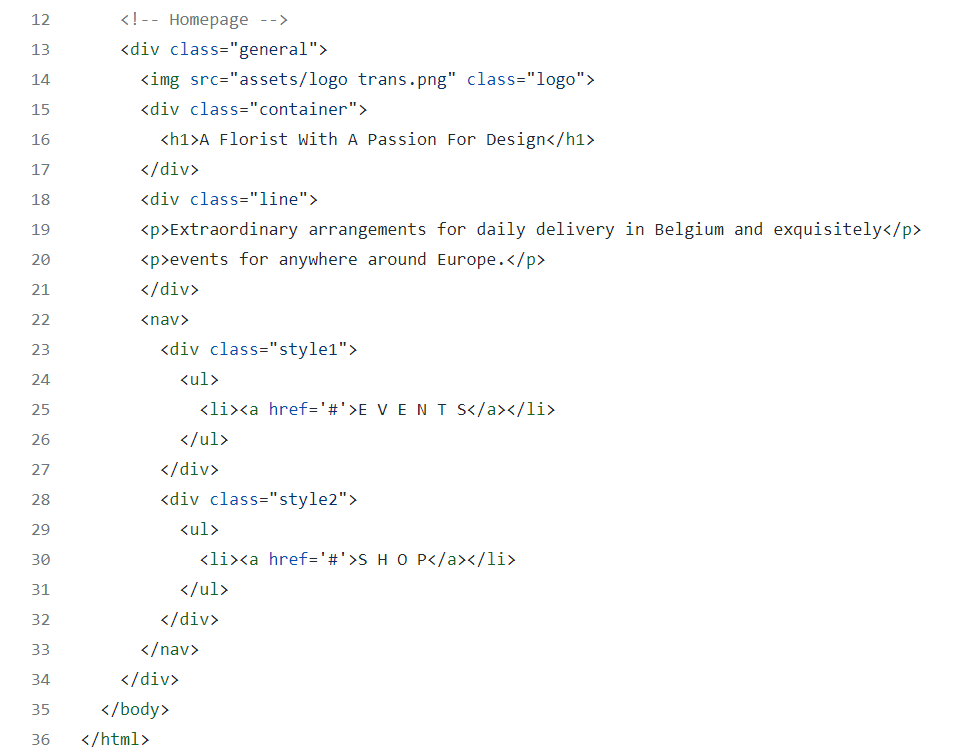

# Name of project

Co-Design a website home page.

In this project we try to build a homepage that is intuitive, user-friendly, and engaging. The *stakeholder interview* is conducted with one of the class partner from group 4 [(Inna)](https://github.com/inna9Z).

Based on the interview and the stakeholder interest, I decided to create a simple website homepage that offers services for prop styling, special occasion and event florals, local deliveries, and walk-in services is also included upon request.

The target audience is people during annual occasions and events; mother's day, valentine's day,
anniversary, wedding, shop/corporate events etc.

>Creating a custom bouquet for people's special days is a delicate thing that involved a lot of details that have to be considered, the service that offered is not only providing their favorite flower yet also designing flowers which involves the story and palette choices that match the mood of the event.

## Table of contents

- [Name of project](#name-of-project)
  - [Table of contents](#table-of-contents)
  - [General info](#general-info)
  - [Screenshots](#screenshots)
  - [Technologies](#technologies)
  - [Setup](#setup)
  - [Code Examples](#code-examples)
  - [Features](#features)
  - [Status](#status)
  - [Inspiration](#inspiration)
  - [Contact](#contact)
  - [Instructions for use](#instructions-for-use)
  - [Code Quality Checks](#code-quality-checks)
  - [Continuous Integration (CI)](#continuous-integration-ci)
  - [Repo Setup](#repo-setup)

## General info

A Florist With A Passion For Design

## Screenshots

## Technologies

- HTML & CSS
- VSC code
- Adobe Photoshop
- Figma
- Canva

## Setup

- `npm run start`

## Code Examples

## Features

List of features ready and Todos for future development

- Responsive web design
- Social media contact
- Gallery

To-do list:

- Hover animation
- Payment link

## Status

Project is: _in progress_

## Inspiration

- Figma template
- Google search

## Contact

By [Name]

## Instructions for use

  
Getting Started

<!-- a guide to using this repository -->

1. `git clone git@github.com:HackYourFutureBelgium/template-markdown.git`
2. `cd template-markdown`
3. `npm install`

## Code Quality Checks

- `npm run format`: Makes sure all the code in this repository is well-formatted
  (looks good).
- `npm run lint:ls`: Checks to make sure all folder and file names match the
  repository conventions.
- `npm run lint:md`: Will lint all of the Markdown files in this repository.
- `npm run lint:css`: Will lint all of the CSS files in this repository.
- `npm run validate:html`: Validates all HTML files in your project.
- `npm run spell-check`: Goes through all the files in this repository looking
  for words it doesn't recognize. Just because it says something is a mistake
  doesn't mean it is! It doesn't know every word in the world. You can add new
  correct words to the [./.cspell.json](./.cspell.json) file so they won't cause
  an error.
- `npm run accessibility -- ./path/to/file.html`: Runs an accessibility analysis
  on all HTML files in the given path and writes the report to
  `/accessibility_report`

## Continuous Integration (CI)

When you open a PR to `main`/`master` in your repository, GitHub will
automatically do a linting check on the code in this repository, you can see
this in the[./.github/workflows/lint.yml](./.github/workflows/lint.yml) file.

If the linting fails, you will not be able to merge the PR. You can double check
that your code will pass before pushing by running the code quality scripts
locally.

## Repo Setup

- Give each member _write_ access to the repo (if it's a group project)
- Turn on GitHub Pages and put a link to your website in the repo's description
- Turn on GitHub Actions
- in the _Branches_ section of your repo's settings make sure:
  - The repository
    [requires a review](https://github.blog/2018-03-23-require-multiple-reviewers/)
    before pull requests can be merged.
  - The `master`/`main` branch must "_Require status checks to pass before
    merging_"
  - The `master`/`main` branch must "_Require require branches to be up to date
    before merging_"

